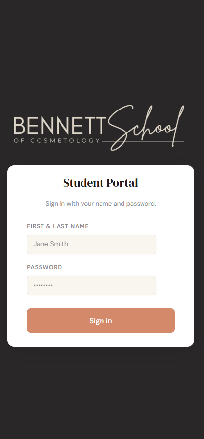
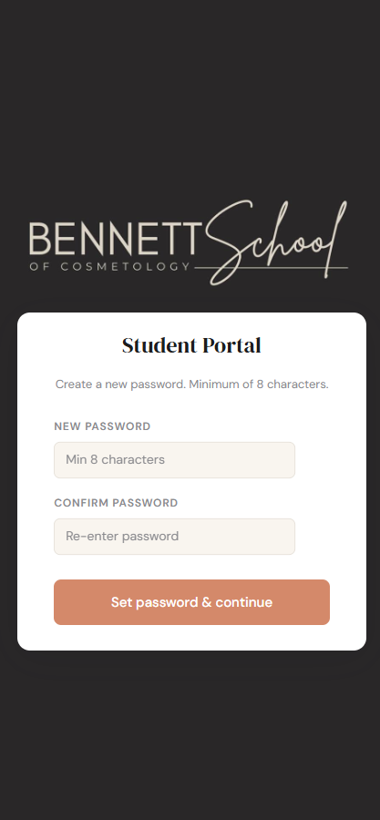
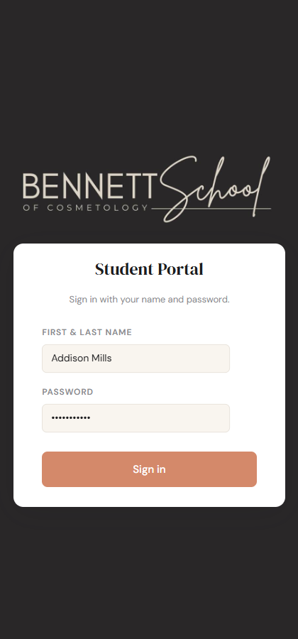
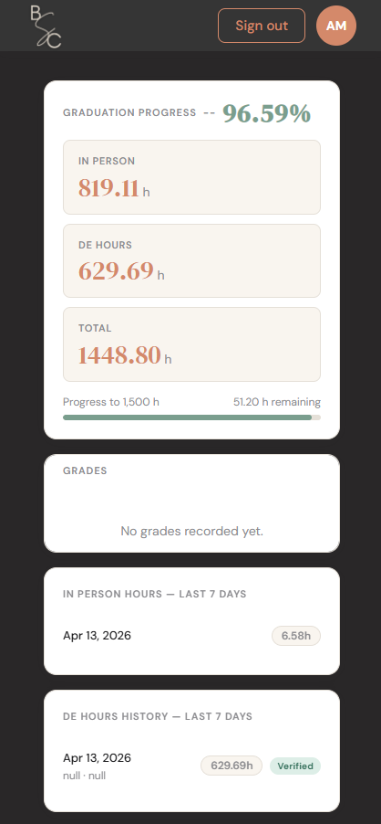
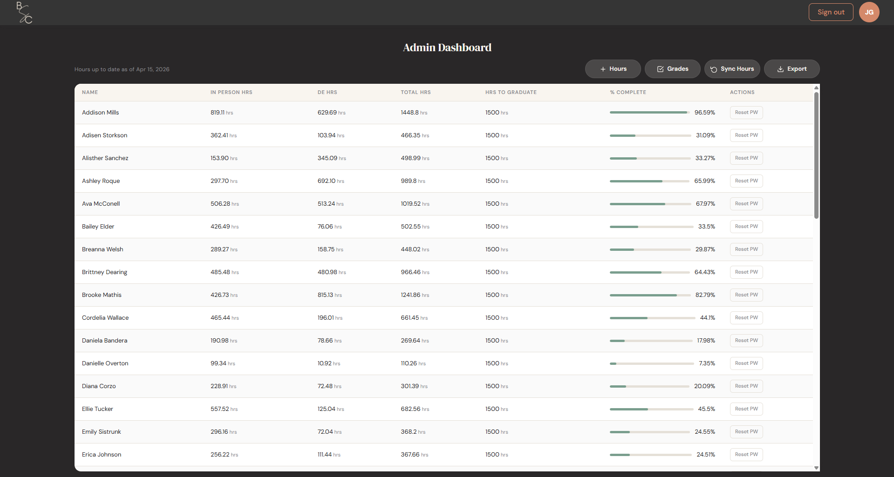

# Bennett Cosmetology Student Portal

## Registration / Login

- **First Time Login**
  - Students/Admin will use their First Name + Last Name and password 'Welcome123' 

- **Update Password**
  - Students/Admin will be routed to a 'Set Password' screen
  - Enter new password in each input
  - Password must be minimum of 8 characters 

- **Subsequent Logins**
  - Students/Admin will use their First Name + Last Name and password they set 

  
## Student Dashboard

Students will be routed to their dashboard that will display:
  - **Hours Totals**
    - **In-Person Hours**: total hours from clocking in / out with Homebase
    - **DE Hours**: total DE hours that are manually entered from an Admin
    - **Total Hours**: sum of `In-Person` and `DE` hours
    - **Percent Complete**: the calculated program completion percentage
    - **Hours Remaining**: hours remaining to complete the program
  - **In-Person Hours Log**
    - Previous 7-Day log of `In-Person` hours
  - **DE Hours Log**
    - Previous 7-Day log of `DE` hours
  - **Grades Log**
    - Log of grades entered 

## Administrator Dashboard

